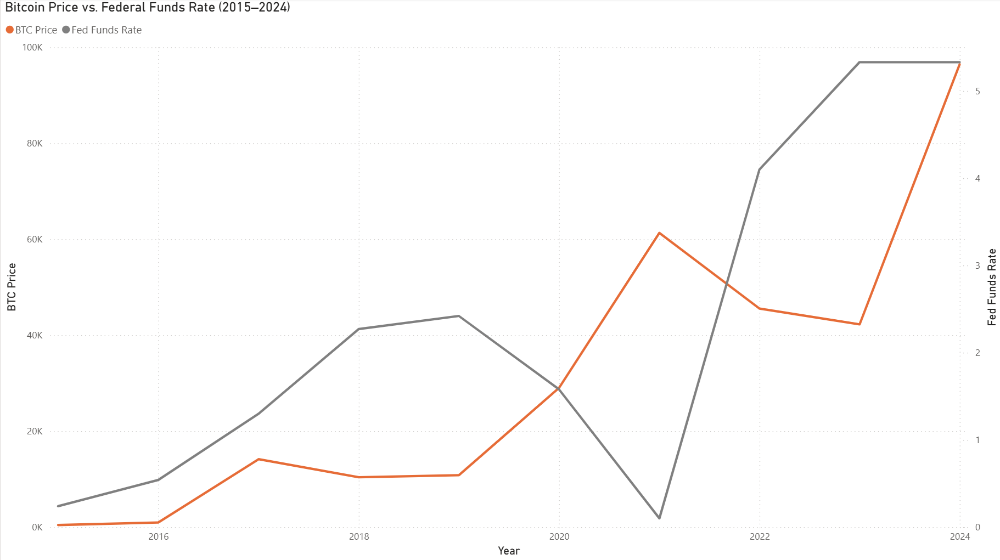
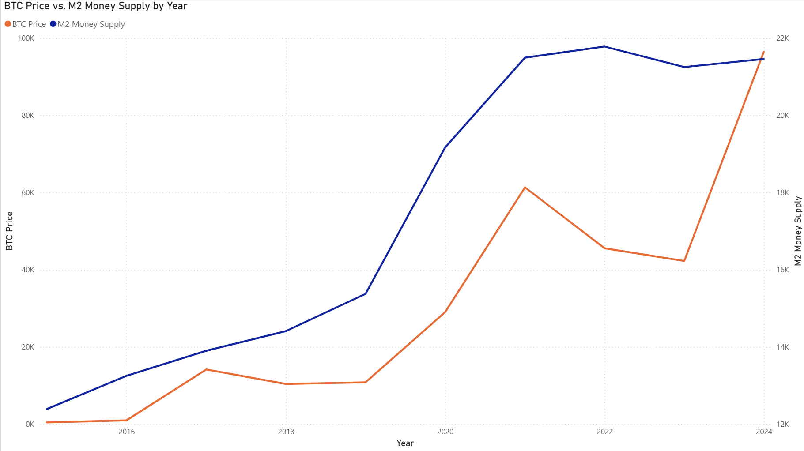
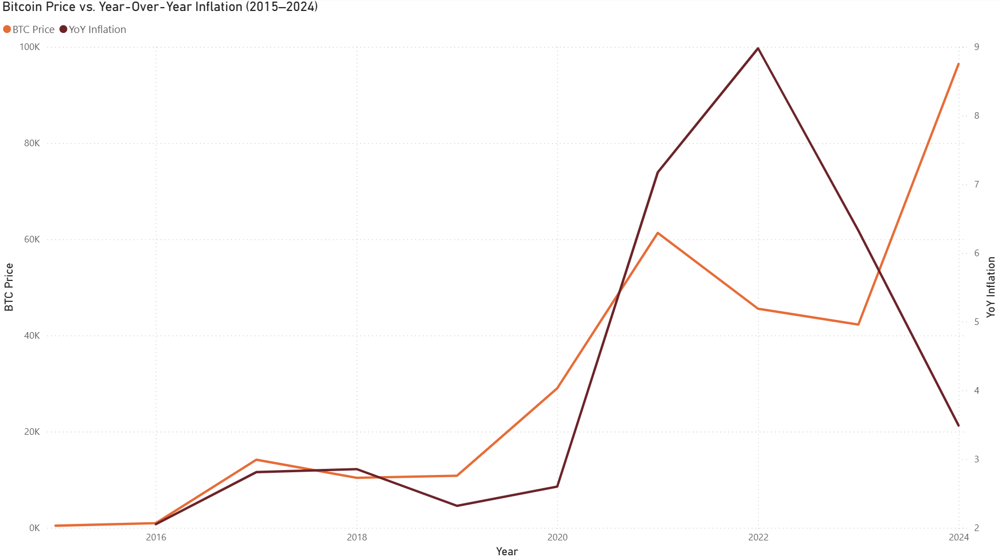
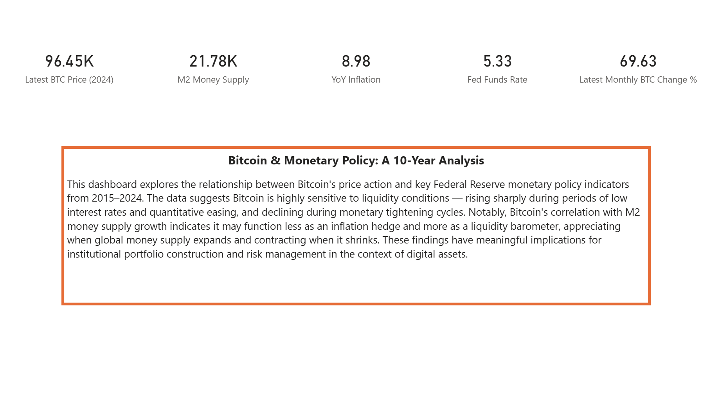

# Bitcoin & Monetary Policy: A 10-Year Analysis

A data dashboard exploring the relationship between Bitcoin's price action and key Federal Reserve monetary policy indicators from 2015–2024, built with Python and Power BI.

---

## Thesis

Bitcoin is highly sensitive to liquidity conditions — rising sharply during periods of low interest rates and quantitative easing, and declining during monetary tightening cycles. Its correlation with M2 money supply growth suggests it functions less as an inflation hedge and more as a **liquidity barometer**, appreciating when global money supply expands and contracting when it shrinks.

---

## Dashboard Pages

### Page 1 — BTC Price vs. Federal Funds Rate

Shows the inverse relationship between Fed rate decisions and BTC price action over 10 years.

### Page 2 — BTC Price vs. M2 Money Supply

Highlights BTC's sensitivity to global liquidity expansion and contraction.

### Page 3 — BTC Price vs. YoY Inflation

Challenges the "Bitcoin as inflation hedge" narrative with 10 years of data.

### Page 4 — Summary & Key Metrics

Snapshot cards showing latest metrics alongside the dashboard thesis.

---

## Key Findings

- **2020–2021:** Fed cuts rates to zero + COVID-era M2 expansion → BTC rises ~1,000%
- **2022:** Fed aggressively hikes rates + M2 contracts → BTC crashes ~75%
- **2023–2024:** Fed begins cutting rates + M2 resumes growth → BTC hits new all-time highs
- **Inflation nuance:** BTC did not consistently act as an inflation hedge — it declined as inflation peaked in 2022, suggesting monetary policy expectations matter more than CPI prints

---

## Data Sources

| Dataset | Source | Series ID |
|---------|--------|-----------|
| Bitcoin Price (Monthly) | Yahoo Finance via `yfinance` | BTC-USD |
| Federal Funds Rate | FRED - Federal Reserve | FEDFUNDS |
| CPI (Inflation) | FRED - Federal Reserve | CPIAUCSL |
| M2 Money Supply | FRED - Federal Reserve | M2SL |

---

## How to Run

### Prerequisites
```bash
pip install pandas requests fredapi matplotlib yfinance
```

### API Keys Required
- **FRED API Key:** Free at https://fred.stlouisfed.org/docs/api/api_key.html

### Steps
1. Clone this repository
2. Open `btc_macro_data.py` and replace `YOUR_FRED_API_KEY_HERE` with your FRED API key
3. Run the script:
```bash
python btc_macro_data.py
```
4. A file called `btc_macro_data.csv` will be generated in the same directory
5. Open `btc_dashboard.pbix` in Power BI Desktop and refresh the data source to point to your local CSV

---

## Tech Stack

- **Python** — Data collection and transformation (pandas, yfinance, fredapi)
- **Power BI** — Dashboard visualization and interactivity
- **FRED API** — Macro economic data
- **Yahoo Finance** — Bitcoin historical price data

---

## About

Built by Luca Antonacci as part of a portfolio project exploring the intersection of traditional finance and digital assets. Currently pursuing a Master of Engineering in FinTech at Duke University's Pratt School of Engineering.

[LinkedIn](https://www.linkedin.com/in/luca-antonacci) | luca.antonacci@duke.edu
